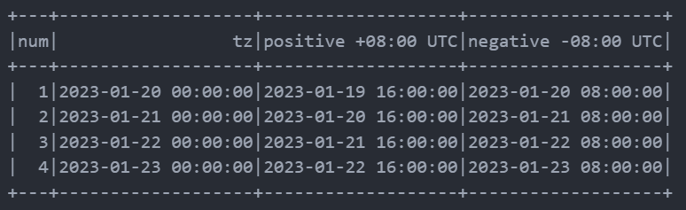

# Datetime functions

Có 2 dạng biến đổi căn bản của datetime object: Từ *string -> datetime* và từ *datetime -> formatted string*

## String -> datetime

```python
df = df.withColumn('Transaction Date tz', f.to_timestamp(df['Transaction Date'], 'dd/MM/yyy HH:mm:ss'))
```

## Datetime -> string

```python
df = df.withColumn('Transaction Date', f.date_format(f.col('Balance Date'),'dd/MM/yyy'))
```

## Operations with datetime object

Ta có thể extract hầu như tất cả các operations trên datetime columns, ví dụ như extract `month`, `dayofweek`, `weekofyear`, `datediff`, ...

## UTC offset

Datetime thường đc lưu dưới định dạng UTC+0 (giờ chuẩn). Để offset datetime object này thành múi giờ riêng, dùng pyspark `to_utc_timestamp`.

[Danh sách tên múi giờ](https://gist.github.com/heyalexej/8bf688fd67d7199be4a1682b3eec7568)

***Lưu ý***: theo UTC, giờ âm là về tương lai, giờ dương là về quá khứ.



```python

# Dùng tên múi giờ
df.withColumn('utc offset', f.to_utc_timestamp(f.col('tz'), 'Asia/Ho_Chi_Minh'))

# dùng time 
df.withColumn('positive +08:00 UTC', f.to_utc_timestamp(f.col('tz'), '+08:00'))
```