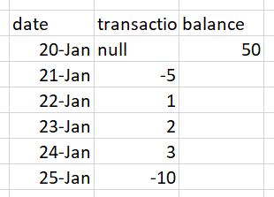

# Window function

Window function là các action thực hiện row-wise thay vì column wise. Window function bao gồm các reader function (`rank`, `dense_rank`, `row_number`) và các aggregation utilize các reader này

Để sử dụng reader function, cần define 1 cửa sổ

```python title="Define window"
from pyspark.sql.window import Window

w1 = Window.partitionBy("col1").orderBy(f.col('col2').desc(), f.col('col1').asc())
```

```python title="Using reader over window"

ranked =  df.withColumn(
  "rank", f.dense_rank().over(w1)
  )

```

trong đó, `rank`, `dense_rank` và `row_number` được coi là các tie-breaker giữa các dữ liệu giống nhau trong `orderBy` columns

- `rank` sẽ đánh dấu các data bằng nhau bằng chung 1 rank, và shift các data đứng sau.
    - rank array: [1,1,1,4,4,6]
- `dense_rank` sẽ đánh dấu các data bằng nhau bằng chung 1 rank, và data đứng sau ko bị shift
    - dense_rank array: [1,1,1,2,2,3]
- `row_number` sẽ cứ đánh dấu tuần tự mặc dù các data bằng nhau
    - row_number array: [1,2,3,4,5,6]


## Dùng aggregation trên reader function

Ví dụ: Đề yêu cầu tính *balance per day* (cummulative sum)



Lúc này, ta phải dùng kĩ thuật ***2 windows***. Kĩ thuật này yêu cầu tạo 1 `ranked` column từ window 1, sau đó dùng aggregate function over window of ranked để cummulative sum 

```python
w1 = Window.partitionBy('Account Number').orderBy(f.col("Balance Date").asc(), f.col('Balance').desc())
w2 = Window.partitionBy('Account Number').orderBy("rownum")

transactions = transactions.withColumn('rownum', f.row_number().over(w1))
output = transactions.withColumn('cumsum', f.sum('Balance').over(w2))
```