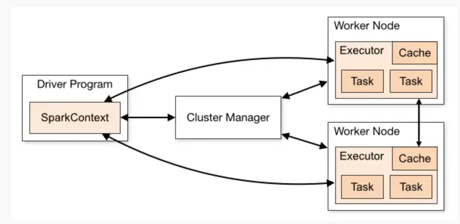

# Mô hình hoạt động của pyspark



Mô hình hoạt động của pyspark bao gồm 1 `Driver Program` tức parent node. Nhiệm vụ node này là thực hiện việc phân chia công việc cho các `Worker Node`, và tập hợp thông tin từ các `Worker Node`.

Mỗi `Worker Node` là 1 máy tính (hoặc 1 computing unit) được cấp phát RAM và CPU thông qua `Cluster Manager`. Một số loại `Cluster Manager` cơ bản là:
- `Standalone`: Thư viện quản lí cluster được cung cấp bởi Spark
- `Hadoop YARN`
- `Apache Mesos`
- `k8s`: quản lí thông qua điều hành container as node
- `local`: dùng CPUs để quản lí node, thích hợp cho run test

`Driver Program` có chứa 1 `SparkContext` là 1 singleton object, tức mỗi Spark application chỉ có 1 `SparkContext`. Việc khởi tạo `SparkContext` là tự động trong pyspark shell, hoặc thông qua tạo tại pyspark script.
Ngoài `SparkContext`, ta còn có khái niệm `SparkSession`. 1 ứng dụng chỉ có 1 `SparkContext` và nhiều `SparkSession`

```python title="Create SparkContext"
from pyspark import SparkContext
sc = SparkContext("local", "App Name")
# trong đó `local` là master name

# default local session including 1 cpu allocation
# local— only 1 core;
# local[4] — 4 cores;
# local[*] — all available cores.
```

```python title="Create SparkSession"
from pyspark.sql import SparkSession

spark = SparkSession.builder.master("local[1]") \
          .appName("SparkByExamples.com") \
          .getOrCreate()
```

`SparkSession` object được tạo ra có 1 `sparkContext` attribute, trả về 1 `SparkContext` object (singleton object) 