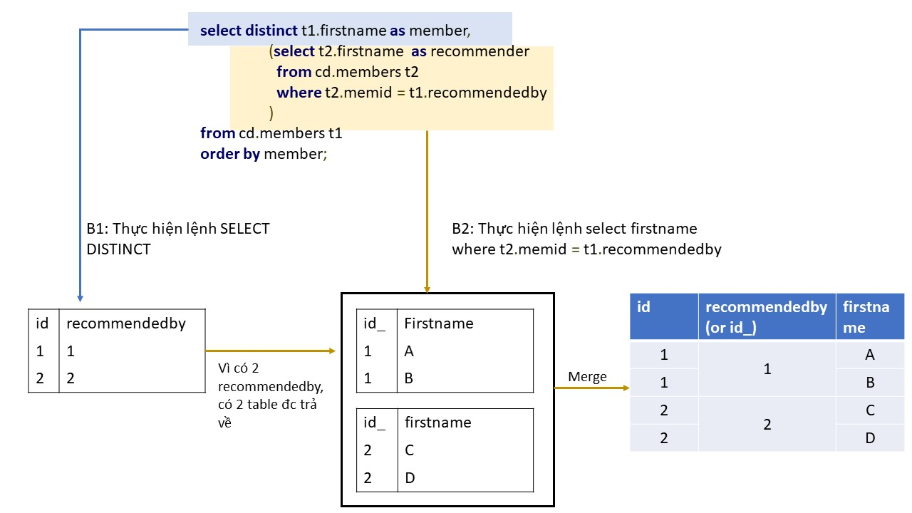

# Correlated subquery

Correlated subquery là 1 query được trigger nhiều hơn 1 lần bởi outer query.

Xét 1 query
```sql
select id from table_A a
where 
	a.id = (some_sub_query)
```

Ta có thể thấy rằng, trong query trên, ta lấy toàn bộ **id** mà giá trị của nó phụ thuộc vào `some_sub_query`. 

Bây giờ ngược lại, ta muốn lấy toàn bộ các giá trị từ `some_sub_query` mà giá trị của nó phụ thuộc vào **id** (ngược lại với ví dụ trên). Như vậy, với mỗi giá trị **id**, ta lại chạy `some_sub_query` một lần (y chang python for loop). 
Bởi vì subquery này được trigger nhiều lần bởi cùng 1 array of **ids**, ta gọi đây là correlated subquery 
```sql
select distinct t1.firstname as member,
	(select t2.firstname as recommender,
	from cd.members t2
	where t2.memid = t1.recommendedby
	)
from cd.members t1
order by member
```
Ta có sơ đồ hoạt động của correlated subquery như sau:



Bởi vì câu lệnh này được gọi bên trong `SELECT` và trước khi `FROM` được gọi, nó còn đc gọi là ***Subquery from SELECT***